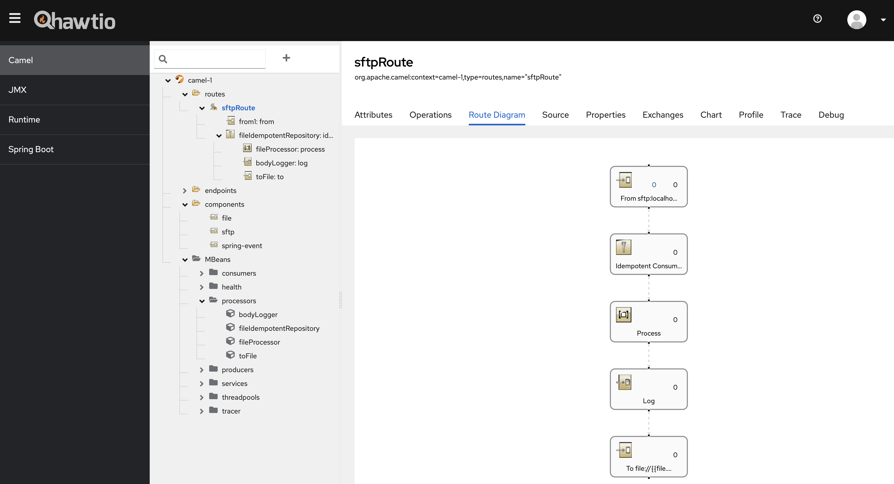

# Spring Boot Camel SFTP Idempotent Consumer Example

This is an example application that copies files from an SFTP server to a local drive. 
The application is designed to only copy files that have not been copied to the local system previously.

## Configuration

The `application.properties` file should be customized to match your environment.

## Hawtio

This application has Hawtio installed to display Camel, and Spring information in a web browser. 
You can view this at [http://localhost:8080/actuator/hawtio](http://localhost:8080/actuator/hawtio) as shown below

